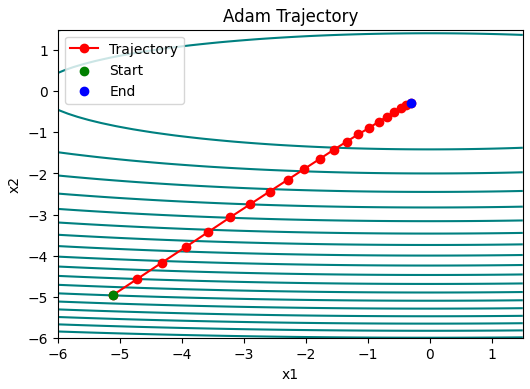

# Optimizers-from-Scratch

## Optimization in Deep Learning

Optimization in deep learning is the process of adjusting model parameters to minimize a loss function. However, while optimization and deep learning share a common ground, their goals differ fundamentally.

## Goal of Optimization vs. Goal of Deep Learning

### Optimization's Goal:
- Focuses on minimizing an objective function (loss function) using mathematical techniques.
- Primarily concerned with achieving the lowest possible **training error**.

### Deep Learning's Goal:
- Aims to build a model that **generalizes well** to unseen data, reducing **generalization error**.
- Requires balancing **optimization** with **regularization** techniques to avoid **overfitting**.

# Challenges in Optimization for Deep Learning

Optimization in deep learning is not always straightforward. Several challenges arise that can make training deep neural networks difficult. Three major challenges are **Local Minima**, **Saddle Points**, and **Vanishing Gradients**.

## Local Minima
Local minima are points where the loss function has a **lower value** than nearby points, but it is **not the global minimum**. In high-dimensional spaces, the probability of getting stuck in a true local minimum is relatively low, but small variations in parameters may lead to **suboptimal convergence**.

For example, given the function

$$f(x) = x \cdot \textrm{cos}(\pi x) \textrm{ for } -1.0 \leq x \leq 2.0,$$


we can approximate the local minimum and global minimum of this function.
### Impact:
- Model may converge to a **suboptimal** solution.
- Training may get stuck and fail to reach the best possible performance.

### Mitigation Strategies:
- Using **momentum-based optimizers** (e.g., Adam, RMSProp) to escape local minima.
- Applying **learning rate scheduling** to navigate better through the loss surface.


## Saddle Points
Saddle points occur when the gradient is **zero**, but the point is **not a minimum** (it is higher in some directions and lower in others). In high-dimensional spaces, saddle points are more common than local minima.

Consider the function $f(x, y) = x^2 - y^2$. It has its saddle point at $(0, 0)$. This is a maximum with respect to $y$ and a minimum with respect to $x$. Moreover, it *looks* like a saddle, which is where this mathematical property got its name.


### Impact:
- Slows down training, as gradients become small and updates become inefficient.
- Can cause optimization algorithms to stall.

### Mitigation Strategies:
- Using **adaptive learning rate methods** like **Adam** or **AdaGrad** to speed up training.
- Increasing **batch size** to stabilize gradients.


## Vanishing Gradients
Vanishing gradients occur when gradients **become too small** during backpropagation, especially in deep networks. This makes it hard for earlier layers to learn meaningful representations.

For instance, assume that we want to minimize the function $f(x) = \tanh(x)$ and we happen to get started at $x = 4$. As we can see, the gradient of $f$ is close to nil.
More specifically, $f'(x) = 1 - \tanh^2(x)$ and thus $f'(4) = 0.0013$. Consequently, optimization will get stuck for a long time before we make progress.


### Impact:
- Slows down or **prevents learning** in deep networks.
- Earlier layers fail to update, affecting overall model performance.

### Mitigation Strategies:
- Using **ReLU** (Rectified Linear Unit) activation functions instead of **sigmoid/tanh** to prevent small gradients.
- Implementing **batch normalization** to stabilize gradients.
- Using **residual connections** (ResNets) to allow direct gradient flow.


Deep learning optimization faces multiple challenges, but **modern techniques and algorithms** help mitigate these issues. By using **advanced optimizers**, **better activation functions**, and **network architectures**, we can improve convergence and achieve **better generalization**.

---

# Convexity in Deep Learning  

## Role of Convexity in Optimization  
Convexity plays a significant role in optimization because **convex functions** have desirable mathematical properties that make optimization easier and more efficient.  

### **Convex Function**  
A function $f(x)$ is convex if its second derivative is always non-negative:  

$$
f''(x) \geq 0 \quad \forall x
$$

This ensures that any local minimum is also a global minimum.  

### **Convex Optimization**  
When the objective function is convex, gradient-based methods like **Gradient Descent** can efficiently find the optimal solution without getting trapped in local minima.  

### **Non-Convexity in Deep Learning**  
Neural networks typically have **non-convex loss landscapes**, meaning they contain multiple local minima, saddle points, and flat regions.  

**Example of a non-convex function:** 

$$
f(x) = x \cdot \cos(\pi x), \quad -1.0 \leq x \leq 2.0
$$

# Newton's Method for Optimization

Newton's method is a second-order optimization algorithm that updates parameters using both the gradient and the Hessian (second derivative) of the function. It provides faster convergence compared to standard gradient descent, especially near the optimal solution.

## Update Rule

The update rule for Newton’s method is given by:

$$
x_{t+1} = x_t - H_f^{-1} \nabla f(x_t)
$$

where:
- **$$∇f(x_t)$$** is the gradient (first derivative) of **$$f(x)$$**.
- **$$H_f$$** is the Hessian matrix (second derivative) of **$$f(x)$$**.


## Gradient Descent vs. Newton's Method

### **Gradient Descent**
Gradient Descent uses only the gradient information for updates:

$$
x_{t+1} = x_t - \eta \nabla f(x_t)
$$

where:
- **$$η$$** is the learning rate, a scalar that controls the step size.
- **$$∇f(x_t)$$** is the gradient (first derivative) of **$$f(x)$$** at **$$xₜ$$**.

### **Newton's Method**
Newton's Method incorporates second-order curvature (Hessian) for more precise updates:

$$
x_{t+1} = x_t - H_f^{-1} \nabla f(x_t)
$$

Below is a Python implementation of Newton's method using PyTorch:

```python
import torch

def f(x, c):
    return torch.cosh(c*x)

def f_grad(x, c):
    return c * torch.sinh(c*x)

def f_hess(x, c):
    return c**2 * torch.cosh(c*x)

def newton(eta = 1, c = torch.tensor(0.5), num_epochs = 10):
    x = torch.tensor(10.0, requires_grad = True)
    results = [x.item()]

    for i in range(num_epochs):
        x = x - eta*f_grad(x,c)/f_hess(x,c)
        results.append(x.item())
        print(f'epoch {i+1}, x: ',x)
    
    return results
```


## Advantages
- **Faster convergence**: Newton's method has a quadratic convergence rate, making it significantly faster near the optimum.
- **Effective for convex functions**: Works well when the Hessian is positive definite.

## Disadvantages
- **Computational cost**: Computing the Hessian and its inverse is expensive, especially in high-dimensional spaces.
- **Hessian issues**: May fail or perform poorly if the Hessian is singular, ill-conditioned, or not positive definite.
- Newton’s method is a lot faster **once** it has started working properly in convex problems.

This method is particularly useful for optimization problems where the function is smooth and well-behaved, but it requires careful handling of the Hessian matrix to avoid computational bottlenecks or numerical instability.

---
# Stochastic Gradient Descent (SGD)

While Newton's Method offers fast convergence by utilizing second-order derivatives (the Hessian matrix), it is computationally expensive for large datasets and high-dimensional models. This leads us to **Stochastic Gradient Descent (SGD)**, which provides a more scalable and efficient alternative.

## Why Move from Newton’s Method to SGD?

- **Scalability**: Newton's Method requires computing and inverting the Hessian matrix, which becomes infeasible for large-scale deep learning models.
- **Efficiency**: SGD updates parameters using a single or small batch of data, making it suitable for handling large datasets.
- **Better Generalization**: Introducing noise in updates (via random sampling) prevents overfitting, helping models generalize better to unseen data.
- **Flexibility**: Unlike Newton’s method, which assumes a well-defined Hessian, SGD is applicable to non-convex optimization problems.

## Stochastic Gradient Descent (SGD)

SGD updates model parameters using only a random subset (mini-batch) of the training data rather than the full dataset. The update rule is:

$$
x_{t+1} = x_t - \eta \nabla f(x_t)
$$

where:
- $$x_t$$ is the parameter vector at iteration $$t$$.
- $$\eta$$ is the learning rate, controlling the step size.
- $$\nabla f(x_t)$$ is the gradient of the loss function at $$x_t$$.

## **Dynamic Learning Rate**

A **static learning rate** $$\eta$$ may not be optimal throughout training. To improve convergence, we use a **time-dependent learning rate** $$\eta(t)$$.

Adjusting $$\eta$$ over time is crucial:
- **Too fast decay** → Stops optimization prematurely.
- **Too slow decay** → Wastes time in optimization.

### **Common Learning Rate Schedules:**

**Piecewise Constant**  
   The learning rate remains constant for fixed intervals and decreases at predefined steps:

$$
\eta(t) = \eta_i \quad \text{if} \quad t_i \leq t \leq t_{i+1}
$$


```python
def sgd (x1, x2, f_grad, eta = 0.1, lr_schedule = lambda : 1):
    g1,g2 = f_grad(x1,x2)
    g1 += torch.normal(0.0, 1, (1,)).item()
    g2 += torch.normal(0.0, 1, (1,)).item() 

    eta_t = eta * lr_schedule()
    x1 -= eta_t * g1
    x2 -= eta_t * g2

    return x1,x2

x1, x2 = -5, -5
eta = 0.01
lr_schedule = lambda : 1 # constant learning rate

steps = 100
trajectory = [(x1,x2)]

for _ in range(steps):
    x1,x2 = sgd(x1,x2, f_grad, eta, lr_schedule)
    trajectory.append((x1,x2))

print(f"Epoch {steps}, x1: {x1}, x2: {x2}\n")

plot_trajectory(f, trajectory, label = 'SGD Trajectory', title = 'SGD Trajectory')       
```


**Exponential Decay**  
   The learning rate decays exponentially over time:
   
$$
\eta(t) = \eta_0 \cdot e^{-\lambda t}
$$
   
where $$\lambda$$ is the decay rate.


```python
def exponential_lr():
    # Global variable that is defined outside this function and updated inside
    global t
    t += 1
    return np.exp(-0.1 * t)

t = 1
lr_schedule = exponential_lr

x1, x2 = -5, -5
eta = 0.01
steps = 100
trajectory = [(x1,x2)]

for _ in range(steps):
    x1,x2 = sgd(x1,x2, f_grad, eta, lr_schedule)
    trajectory.append((x1,x2))

print(f"Epoch {steps}, x1: {x1}, x2: {x2}\n")
plot_trajectory(f, trajectory, label = 'SGD Trajectory', title = 'SGD Trajectory with exponential learning rate decay')
       
```


**Polynomial Decay**  
   The learning rate follows a polynomial decay rule:
   
$$
\eta(t) = \eta_0 \cdot (\beta t + 1)^{-\alpha}
$$

where $$\beta$$ and $$\alpha$$ control the decay rate.

```python
def polynomial_lr():
    # Global variable that is defined outside this function and updated inside
    global t
    t += 1
    return (1 + 0.1 * t) ** (-0.5)


t = 1
lr_schedule = polynomial_lr

x1, x2 = -5, -5
eta = 0.01
steps = 100
trajectory = [(x1,x2)]

for _ in range(steps):
    x1,x2 = sgd(x1,x2, f_grad, eta, lr_schedule)
    trajectory.append((x1,x2))

print(f"Epoch {steps}, x1: {x1}, x2: {x2}\n")
plot_trajectory(f, trajectory, label = 'SGD Trajectory', title = 'SGD Trajectory with polynomial learning rate')
```  


## Advantages  
- Computationally efficient – Updates are based on small batches rather than the full dataset.  
- Handles large-scale data – Suitable for deep learning with millions of parameters.  
- Prevents overfitting – The noise in updates helps generalization.  
- Adaptability – Works well with adaptive learning rate techniques like Adam, RMSprop.  

## Disadvantages  
- Noisy convergence – Updates fluctuate due to random sampling.  
- Requires careful tuning – Learning rate selection significantly affects performance.  
- Slower convergence – Compared to second-order methods like Newton’s Method.
  
---

# Mini-batch Stochastic Gradient Descent (Mini-batch SGD)

## Why Move from SGD to Mini-batch SGD?

In the past, we usually used it for granted that we would read *minibatches* of data rather than single observations to update parameters during Gradienr Descent. Now, we provide a brief justification for this transition.

Processing single observations requires performing many individual matrix-vector (or even vector-vector) multiplications. This is computationally expensive and incurs significant overhead within deep learning frameworks. This overhead applies to both inference (evaluating a network on data) and gradient computation for parameter updates.

Instead of computing the gradient for a single observation:

$$
g_t = \partial_w f(x_t, w)
$$

we compute it for a **minibatch** of observations:

$$
g_t = \partial_w \frac{1}{|B_t|} \sum_{i \in B_t} f(x_i, w)
$$

where:
- **$$g_t$$** is the gradient at iteration **$$t$$**.
- **$$B_t$$** is the minibatch of observations at iteration **$$t$$**.
- **$$|B_t|$$** is the size of the minibatch.
- **$$w$$** represents the model parameters.
- **$$f(x_i, w)$$** is the loss function for the **$$i-th$$** observation.

This change has several key benefits:

- The **expectation** of the gradient remains unchanged, as all elements of the minibatch are drawn randomly from the training set.
- The **variance** of the gradient is significantly reduced. Since the minibatch gradient consists of $$b = |\mathcal{B}_t|$$ independent gradients being averaged, its standard deviation is reduced by a factor of $$b^{-\frac{1}{2}}$$.

### Choosing the Right Minibatch Size

A larger minibatch size can reduce variance, leading to more stable updates. However, increasing the batch size beyond a certain point leads to diminishing returns due to the linear increase in computational cost. 

In practice, minibatches are chosen to balance **computational efficiency** and **memory limitations** of GPUs.

```python
def f_grad_batch(X_batch):
    grads = np.zeros_like(X_batch)
    for i in range(X_batch.shape[0]):
        x1, x2 = X_batch[i]
        g1, g2 = f_grad(x1, x2)
        # Add small Gaussian noise
        g1 += np.random.normal(0.0, 0.1)  # Reduced noise variance
        g2 += np.random.normal(0.0, 0.1)
        grads[i] = [g1, g2]
    return grads


# Minibatch SGD function
def minibatch_sgd(X, batch_size, eta=0.1, num_epochs=10):
    n_samples = X.shape[0]
    trajectory = []  # Track the optimization path
    # x1, x2 = -5,-5  # Start at the mean of the data
    x = X.mean(axis = 0)
    x1,x2 = x[0], x[1]
    trajectory.append((x1, x2))

    for epoch in range(num_epochs):
        # Shuffle data
        np.random.shuffle(X)
        for i in range(0, n_samples, batch_size):
            # Minibatch
            X_batch = X[i:i + batch_size]
            # Compute average gradient for the batch
            grads = f_grad_batch(X_batch)
            avg_grad = grads.mean(axis=0)
            # Gradient update
            X[i:i + batch_size, 0] -= eta * avg_grad[0]
            X[i:i + batch_size, 1] -= eta * avg_grad[1]
            x = X.mean(axis = 0)
            x1,x2 = x[0], x[1]
            # Track trajectory
        trajectory.append((x1, x2))

    return trajectory
```  


## Advantages
- Improves computational efficiency by processing multiple samples simultaneously.
- Reduces gradient variance, leading to more stable updates.
- Balances between noisy updates (SGD) and expensive full-batch computations.

## Disadvantages
- Requires tuning of minibatch size to balance efficiency and convergence speed.
- May require more memory compared to standard SGD.
- Can still be affected by noisy gradients if the batch size is too small.

---

# Momentum Optimization

## Why Move from SGD to Momentum?

Stochastic Gradient Descent (SGD) updates parameters using only a noisy approximation of the true gradient. This introduces significant challenges:

- **High Variance**: The updates fluctuate due to noise, making convergence slower.
- **Poor Handling of Ill-Conditioned Problems**: When some directions require much smaller steps than others (e.g., a narrow canyon-shaped loss function), SGD struggles to make consistent progress.
- **Inefficient Averaging**: While minibatch SGD reduces variance by averaging over a batch, it does not utilize past gradients effectively.

To address these issues, we introduce **Momentum Optimization**, which leverages a moving average of past gradients to provide more stable updates.

## Basics

Momentum optimization is an enhancement to gradient descent that accumulates past gradients to smooth updates. Instead of using only the most recent gradient, we compute an exponentially weighted moving average of past gradients.

### Leaky Averages

In minibatch SGD, the gradient is computed as:

$$
g_{t, t-1} = \frac{1}{|B_t|} \sum_{i \in B_t} h_{i, t-1}
$$

where

$$
h_{i, t-1} = \nabla_w f(x_i, w_{t-1})
$$

is the gradient for sample $$i$$ at time $$t-1$$.

To benefit from variance reduction beyond minibatch averaging, we replace the gradient with a "leaky average" known as **velocity**:

$$
v_t = \beta v_{t-1} + g_{t, t-1}
$$

where $$\beta \in (0,1)$$ controls how much past gradients influence the current update.

Expanding $$v_t$$ recursively:

$$
v_t = \sum_{\tau = 0}^{t-1} \beta^{\tau} g_{t-\tau, t-\tau-1}
$$

- A **large $$\beta$$** results in a longer-range average, smoothing updates more effectively.
- A **small $$\beta$$** gives only a slight correction to the gradient.

This moving average helps stabilize descent, reducing oscillations and making optimization more efficient.

## The Momentum Method

Momentum optimization modifies SGD by updating parameters using the **velocity** instead of the raw gradient:

$$
\begin{aligned}
v_t &\leftarrow \beta v_{t-1} + g_{t, t-1}, \\
x_t &\leftarrow x_{t-1} - \eta_t v_t.
\end{aligned}
$$

- When $$\beta = 0$$, this reduces to standard gradient descent.
- Larger $$\beta$$ values allow more stable updates and better convergence.

Momentum is particularly useful when gradients oscillate in some directions while being well-aligned in others. It helps **accelerate learning in flatter directions** while **reducing oscillations in steep directions**.

```python
# Momentum function
def momentum(X, batch_size, eta=0.1, num_epochs=10, beta = 0.25):
    n_samples = X.shape[0]
    trajectory = []  # Track the optimization path
    
    x = X.mean(axis = 0)
    x1,x2 = x[0], x[1]
    v1, v2 = 0,0
    trajectory.append((x1, x2))

    for epoch in range(num_epochs):
        # Shuffle data
        np.random.shuffle(X)
        for i in range(0, n_samples, batch_size):
            # Minibatch
            X_batch = X[i:i + batch_size]
            # Compute average gradient for the batch
            grads = f_grad_batch(X_batch)
            avg_grad = grads.mean(axis=0)
            v1 = beta * v1 + (1-beta)*avg_grad[0]
            v2 = beta * v2 + (1-beta)*avg_grad[1]
        
            # Gradient update
            X[i:i + batch_size, 0] -= eta * v1
            X[i:i + batch_size, 1] -= eta * v2
            x = X.mean(axis = 0)
            x1,x2 = x[0], x[1]
            # Track trajectory
        trajectory.append((x1, x2))

    return trajectory
```  


## Advantages
- **Faster convergence**: Accumulates past gradients for smoother updates.
- **Reduces oscillations**: Helps when the loss surface has sharp valleys.
- **Works well for deep learning**: Often improves training stability and efficiency.

## Disadvantages
- **Hyperparameter tuning**: Choosing an optimal $$\beta$$ is non-trivial.
- **May overshoot minima**: Large momentum values can lead to instability.
- **Additional memory cost**: Stores velocity values for each parameter.

---

# Adagrad Optimizer

## Why Move from Momentum to Adagrad?

While Momentum optimization improves upon standard stochastic gradient descent (SGD) by accelerating convergence and smoothing out oscillations, it has limitations:

- It applies the same learning rate to all parameters, which is suboptimal for problems where different parameters require different learning rates.
- It does not adapt to the scale of gradients, which can lead to inefficient updates.
- In scenarios with sparse features, Momentum does not take into account the frequency of updates for each parameter.

To address these issues, **Adagrad (Adaptive Gradient Algorithm)** modifies the learning rate dynamically for each parameter based on past gradient information.

## Adagrad Algorithm

Adagrad adapts the learning rate for each parameter using the sum of squared gradients. The update equations are:

$$
\begin{aligned}
    g_t &= \frac{\partial}{\partial w} l(y_t, f(x_t, w_t)), \\
    s_t &= s_{t-1} + g_t^2, \\
    w_t &= w_{t-1} - \frac{\eta}{\sqrt{s_t + \epsilon}} \cdot g_t.
\end{aligned}
$$

where:
- $$g_t$$ is the gradient at time $$t$$,
- $$s_t$$ accumulates the squared gradients,
- $$\eta$$ is the learning rate,
- $$\epsilon$$ is a small constant to prevent division by zero,
- The updates are performed element-wise, adjusting each parameter's learning rate independently.

```python
# Adagrad SGD function
def adagrad(X, batch_size, eta=0.1, num_epochs=10):
    n_samples = X.shape[0]
    trajectory = []  # Track the optimization path
    
    x = X.mean(axis = 0)
    x1,x2 = x[0], x[1]
    s1, s2 = 0,0
    eps = 1e-6
    trajectory.append((x1, x2))

    for epoch in range(num_epochs):
        # Shuffle data
        np.random.shuffle(X)
        for i in range(0, n_samples, batch_size):
            # Minibatch
            X_batch = X[i:i + batch_size]
            # Compute average gradient for the batch
            grads = f_grad_batch(X_batch)
            avg_grad = grads.mean(axis=0)
            g1 = avg_grad[0]
            g2 = avg_grad[1]
            s1 += g1**2
            s2 += g2**2
        
            # Gradient update
            X[i:i + batch_size, 0] -= eta / np.sqrt(s1 + eps) * g1
            X[i:i + batch_size, 1] -= eta / np.sqrt(s2 + eps) * g2
            x = X.mean(axis = 0)
            x1,x2 = x[0], x[1]
            # Track trajectory
        trajectory.append((x1, x2))

    return trajectory
```  


## Advantages

- **Adaptive Learning Rate**: Each parameter gets an individualized learning rate, making it effective for sparse data.
- **No Manual Learning Rate Tuning**: Adapts learning rates based on gradient history, reducing the need for hyperparameter tuning.
- **Works Well for Sparse Data**: Frequently updated parameters get smaller updates, while infrequent ones retain higher learning rates.

## Disadvantages

- **Continuous Learning Rate Decay**: Since $$s_t$$ keeps growing, the learning rate keeps decreasing, which may slow or stop learning.
- **Not Ideal for Deep Learning**: In deep networks, the decay can become too aggressive, leading to vanishing updates.

---

# RMSProp Optimizer

## Why Move from Adagrad to RMSProp?

While **Adagrad** is useful due to its ability to adjust the learning rate for each parameter based on its gradient history, it suffers from a key limitation: **the learning rate continually decays** as the algorithm progresses, following a schedule of **$$O(t^{-1/2})$$**. This is suitable for convex problems but is **not ideal for non-convex problems**, especially in deep learning.

In deep learning, this continuous decay of the learning rate can lead to **very small updates in later stages** of training, causing the algorithm to converge prematurely. The key issue with Adagrad is that it **accumulates the squared gradients** into a state vector that keeps growing without bound. This results in the learning rate decreasing faster over time, which can significantly slow down the training process, especially in problems with a **non-convex landscape**.

To address this, **RMSProp (Root Mean Square Propagation)** was proposed. RMSProp modifies Adagrad by introducing a **leaky average** of the squared gradients, allowing the algorithm to continue learning at an appropriate pace without the unbounded accumulation of gradient information.

## RMSProp Algorithm

The RMSProp algorithm uses a **moving average** of the squared gradients to adjust the learning rate for each parameter dynamically, decoupling the rate scheduling from the coordinate-adaptive learning rates.

The update equations for RMSProp are:

$$
\begin{aligned}
    s_t & \leftarrow \gamma s_{t-1} + (1 - \gamma) g_t^2, \\
    x_t & \leftarrow x_{t-1} - \frac{\eta}{\sqrt{s_t + \epsilon}} \odot g_t.
\end{aligned}
$$

Where:
- $$g_t$$ is the gradient at time step $$t$$,
- $$s_t$$ is the leaky average of squared gradients,
- $$\eta$$ is the learning rate,
- $$\gamma$$ is the decay factor for the moving average, typically set between 0.9 and 0.99,
- $$\epsilon$$ is a small constant (often $$10^{-6}$$) to avoid division by zero.

The key difference from Adagrad is the use of a **leaky average** for $$s_t$$, which prevents the learning rate from decaying too quickly.

Expanding the definition of $$s_t$$:

$$
\begin{aligned}
s_t &= (1 - \gamma) g_t^2 + \gamma s_{t-1}, \\
    &= (1 - \gamma) \left(g_t^2 + \gamma g_{t-1}^2 + \gamma^2 g_{t-2}^2 + \ldots \right).
\end{aligned}
$$

The sum of weights $$1 + \gamma + \gamma^2 + \ldots$$ is normalized to $$\frac{1}{1 - \gamma}$$, giving a **half-life** time for past observations of $$\gamma^{-1}$$.

```python
# RMSProp function
def rmsprop(X, batch_size, eta=0.1, num_epochs=10, gamma = 0.9):
    n_samples = X.shape[0]
    trajectory = []  # Track the optimization path
    
    x = X.mean(axis = 0)
    x1,x2 = x[0], x[1]
    s1, s2 = 0,0
    eps = 1e-6
    trajectory.append((x1, x2))

    for epoch in range(num_epochs):
        # Shuffle data
        np.random.shuffle(X)
        for i in range(0, n_samples, batch_size):
            # Minibatch
            X_batch = X[i:i + batch_size]
            # Compute average gradient for the batch
            grads = f_grad_batch(X_batch)
            avg_grad = grads.mean(axis=0)
            g1 = avg_grad[0]
            g2 = avg_grad[1]
            s1 = gamma * s1 + (1-gamma) * g1**2
            s2 = gamma * s2 + (1-gamma) * g2**2
        
            # Gradient update
            # X[:,0] -= eta / np.sqrt(s1 + eps) * g1
            # X[:,1] -= eta / np.sqrt(s2 + eps) * g2
            X[i:i + batch_size, 0] -= eta / np.sqrt(s1 + eps) * g1
            X[i:i + batch_size, 1] -= eta / np.sqrt(s2 + eps) * g2
            x = X.mean(axis = 0)
            x1,x2 = x[0], x[1]
            # Track trajectory
        trajectory.append((x1, x2))

    return trajectory
```  


## Advantages

- **Prevents Learning Rate Decay**: The leaky average of squared gradients prevents the learning rate from decaying too rapidly, allowing for continued learning in non-convex problems like deep learning.
- **Coordinates Adaptively**: Just like Adagrad, RMSProp applies an adaptive learning rate to each parameter based on its gradient history, which is beneficial for sparse data and non-convex optimization.
- **Improved Convergence**: The normalization of gradient history and dynamic learning rates make RMSProp more effective for non-convex problems, leading to better convergence in deep learning.

## Disadvantages

- **Hyperparameter Tuning**: The decay parameter $$\gamma$$ and learning rate $$\eta$$ still need to be carefully tuned for optimal performance.
- **Sensitive to Initialization**: RMSProp can be sensitive to the choice of initial parameters, especially for deep neural networks, where improper initialization might cause instability during training.

--- 

# Adam Optimizer

Adam (short for **Adaptive Moment Estimation**) is one of the most popular optimization algorithms in deep learning due to its combination of advantages from other optimization methods. It is a robust and efficient learning algorithm that adapts the learning rate based on both the first moment (momentum) and the second moment (variance) of the gradients. Let's go over why we choose Adam over other algorithms and what makes it so effective.

## Why Choose Adam?

### 1. **Combines Best Features from Multiple Optimizers**
Adam combines the advantages of several other optimization techniques:
- **SGD** (Stochastic Gradient Descent) for efficient gradient-based optimization.
- **Momentum** to accelerate convergence by considering past gradients.
- **RMSProp** to adapt the learning rate based on the magnitude of recent gradients.

These characteristics make Adam a very versatile and powerful optimizer, particularly in deep learning where optimization landscapes can be non-convex and complex.

### 2. **Adaptive Learning Rate**
Adam uses adaptive learning rates for each parameter, much like **Adagrad** and **RMSProp**. However, Adam refines this by using both the first moment (momentum) and the second moment (variance) of the gradients, allowing the algorithm to adjust the learning rate dynamically. This helps overcome the problem of the learning rate becoming too small, as seen with **Adagrad**, and prevents premature convergence.

### 3. **Bias Correction**
Adam incorporates **bias correction** for both momentum and variance estimates. Early in training, the first and second moments are initialized as zero, causing a bias toward smaller values. Adam corrects for this bias to ensure the updates are accurate, particularly in the initial stages of training.

### 4. **Efficient for Large Datasets**
Adam is computationally efficient and requires little memory, making it highly suitable for training large models with large datasets. This efficiency makes Adam a go-to choice for training deep learning models on large-scale problems.

## The Adam Algorithm

The core idea behind Adam is the use of **exponentially weighted moving averages (EWMA)** to estimate both the momentum and the second moment of the gradients. The update rules for Adam are as follows:

### 1. **Update Momentum and Second Moment Estimates**
At each timestep $$t$$, Adam maintains two estimates:
- The momentum estimate $$v_t$$, which captures the moving average of the past gradients.
- The second moment estimate $$s_t$$, which captures the moving average of the squared gradients.

The equations for these updates are:

$$
v_t \leftarrow \beta_1 v_{t-1} + (1 - \beta_1) g_t,
$$

$$
s_t \leftarrow \beta_2 s_{t-1} + (1 - \beta_2) g_t^2,
$$

Where:
- $$g_t$$ is the gradient at timestep $$t$$,
- $$\beta_1$$ and $$\beta_2$$ are the momentum and variance decay parameters (typically set to $$\beta_1 = 0.9$$ and $$\beta_2 = 0.999$$).

### 2. **Bias Correction**
To correct the bias introduced by the initial values of $$v_t$$ and $$s_t$$, we use bias-corrected estimates:

$$
\hat{v}_t = \frac{v_t}{1 - \beta_1^t}, \quad \hat{s}_t = \frac{s_t}{1 - \beta_2^t}.
$$

### 3. **Gradient Rescaling**
Adam then rescales the gradient using the bias-corrected momentum and variance estimates:

$$
g_t' = \frac{\eta \hat{v}_t}{\sqrt{\hat{s}_t} + \epsilon},
$$

Where:
- $$\eta$$ is the learning rate,
- $$\epsilon$$ is a small constant (e.g., $$10^{-6}$$) to prevent division by zero.

### 4. **Update the Parameters**
Finally, the parameters are updated as follows:

$$
x_t \leftarrow x_{t-1} - g_t'.
$$

This update rule incorporates both momentum and adaptive learning rates, ensuring efficient and stable convergence.

```python
# Adam function
def adam(X, batch_size, eta=0.1, num_epochs=10, beta1 = 0.9, beta2 = 0.999):
    n_samples = X.shape[0]
    trajectory = []  # Track the optimization path
    
    x = X.mean(axis = 0)
    x1, x2 = x[0], x[1]
    v1, v2 = 0, 0
    s1, s2 = 0, 0
    eps = 1e-6
    t = 0 # time step for bias correction
    trajectory.append((x1, x2))

    for epoch in range(num_epochs):
        # Shuffle data
        np.random.shuffle(X)
        for i in range(0, n_samples, batch_size):
            t += 1
            # Minibatch
            X_batch = X[i:i + batch_size]
            # Compute average gradient for the batch
            grads = f_grad_batch(X_batch)
            avg_grad = grads.mean(axis=0)
            g1 = avg_grad[0]
            g2 = avg_grad[1]
            
            v1 = beta1 * v1 + (1-beta1) * g1
            v2 = beta1 * v2 + (1-beta1) * g2
            s1 = beta2 * s1 + (1-beta2) * g1**2
            s2 = beta2 * s2 + (1-beta2) * g2**2

            # Bias-corrected moments
            v1_corr = v1 / (1 - beta1**t)
            v2_corr = v2 / (1 - beta1**t)
            s1_corr = s1 / (1 - beta2**t)
            s2_corr = s2 / (1 - beta2**t)
        
            # Gradient update
            X[i:i + batch_size, 0] -= eta / (np.sqrt(s1_corr) + eps) * v1_corr
            X[i:i + batch_size, 1] -= eta / (np.sqrt(s2_corr) + eps) * v2_corr

            # Update trajectory
            x = X.mean(axis = 0)
            x1,x2 = x[0], x[1]
            # Track trajectory
        trajectory.append((x1, x2))

    return trajectory
```  


## Advantages 

- **Combines Multiple Optimizers**: Adam blends the strengths of SGD, momentum, Adagrad, and RMSProp, making it one of the most robust optimizers.
- **Adaptive Learning Rates**: Adam adjusts the learning rate for each parameter based on the first and second moments of the gradients, improving training efficiency.
- **Bias Correction**: By correcting for the bias during early stages of training, Adam ensures that updates are accurate and stable even in the beginning.
- **Efficient**: Adam is computationally efficient and requires less memory, making it a great choice for training deep neural networks on large datasets.
- **Works Well on Non-Convex Problems**: Unlike traditional gradient descent, Adam is particularly suited for non-convex optimization problems, commonly encountered in deep learning.

## Disadvantages

- **Sensitive to Hyperparameters**: Like most optimizers, Adam can be sensitive to its hyperparameters ($$\beta_1, \beta_2, \eta$$). If the values are not chosen carefully, Adam may not converge optimally.
- **Poor Performance on Small Batches**: When using very small minibatches, Adam may experience high variance in the estimates, which could lead to instability in the training process.
- **Memory Intensive**: Although Adam is efficient in terms of computation, it still requires memory to store the momentum and variance estimates for each parameter, which could become an issue for extremely large models.

## Conclusion

Adam is a very powerful optimizer that combines momentum, RMSProp, and adaptive learning rates into a single framework. This combination allows it to efficiently train deep learning models, especially on non-convex problems. However, like all optimization algorithms, it requires careful tuning of hyperparameters to work effectively. Despite its potential drawbacks, Adam has become the default choice for many deep learning tasks due to its speed, adaptability, and robustness.

---
**Follow for more insights on Deep Learning and Optimization!** 🚀


